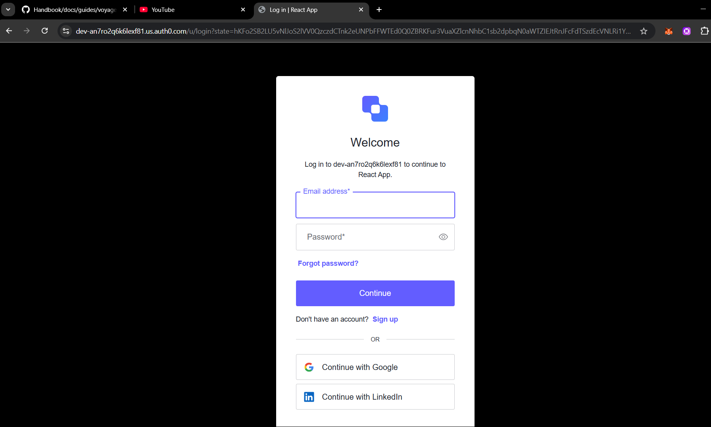
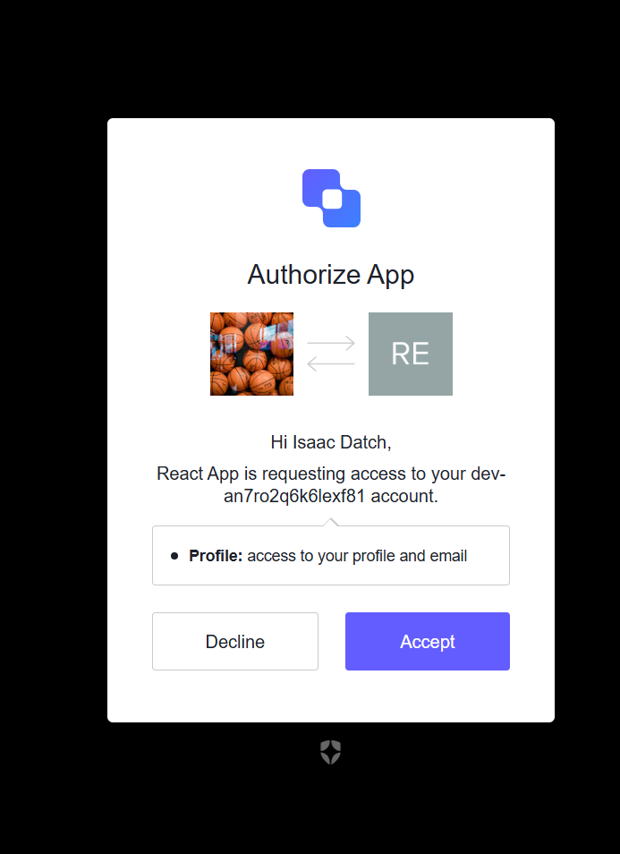
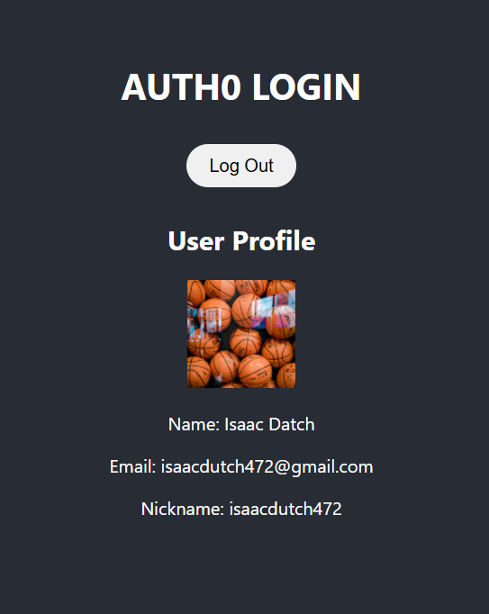

# 🔐 Auth0 Authentication Demo

This project is a basic implementation of **Auth0 authentication** in a React application. It demonstrates how to:

- Authenticate users using Auth0
- Display user information after login

---

## 📸 Demo Screenshots

### 🔑 Login with Auth0


### 👤 User Profile After Login
Displays user name, email, and profile picture:



---

## 💡 How Auth0 Works in This App

### 🌐 Frontend (React)
1. **Auth0Provider** wraps the entire app with authentication context.
2. When the user clicks **"Log in"**, they are redirected to the Auth0 hosted login page.
3. After login, Auth0 redirects the user back with an **authorization code**.
4. The SDK exchanges this code for an **access token** and stores it.
5. We use the `useAuth0()` hook to:
   - Get user details (e.g., `user.name`, `user.email`)
   - Trigger login/logout
   - Securely fetch the **access token**

---

## 🛠️ Tech Stack

- **Frontend**: React, Auth0 React
- **Auth Provider**: Auth0

---

## ⚙️ How to Run the Project

### 1. Clone the repo
```bash
git clone https://github.com/Brandon-Isaac/Auth-o-demo
cd Auth-o-demo
